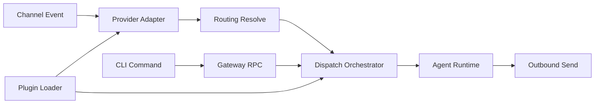

# Architecture map

This page is the source of truth for OpenClaw runtime module boundaries and
ownership by domain.

For operational gateway behavior, see [Gateway runbook](/gateway).  
For protocol-level architecture, see [Gateway architecture](/concepts/architecture).

## Primary entrypoints

| Surface           | Entrypoint                            | Purpose                                                                             |
| ----------------- | ------------------------------------- | ----------------------------------------------------------------------------------- |
| CLI bootstrap     | `src/entry.ts`                        | Process bootstrap, env normalization, CLI handoff to `src/cli/run-main.ts`          |
| CLI command graph | `src/cli/program/register.subclis.ts` | Lazy/eager subcommand registration and command namespace boundaries                 |
| Gateway runtime   | `src/gateway/server.impl.ts`          | Runtime assembly for auth, WS/HTTP, channels, routing, plugins, background services |
| Plugin runtime    | `src/plugins/loader.ts`               | Discovery, manifest registry, trust policy gating, plugin load orchestration        |
| Route resolution  | `src/routing/resolve-route.ts`        | Deterministic inbound route selection and agent/session targeting                   |

## Ownership by runtime domain

| Domain                | Primary paths                                                                                         | Contract                                                                                           |
| --------------------- | ----------------------------------------------------------------------------------------------------- | -------------------------------------------------------------------------------------------------- |
| CLI + command UX      | `src/cli/**`, `src/commands/**`                                                                       | Parse user intent, call typed runtime services, avoid embedding channel transport details          |
| Gateway control plane | `src/gateway/**`                                                                                      | Own auth, transport, state fanout, and service lifecycle; delegate domain logic to focused modules |
| Routing               | `src/routing/**`                                                                                      | Pure route/identity/session derivation; no transport side effects                                  |
| Channel providers     | `src/telegram/**`, `src/discord/**`, `src/signal/**`, `src/imessage/**`, `src/slack/**`, `src/web/**` | Adapter layer from provider events to normalized dispatch inputs                                   |
| Plugins               | `src/plugins/**`                                                                                      | Extension lifecycle, schema contract, trust/provenance policy, plugin command/handler registration |
| Inbound dispatch      | `src/auto-reply/dispatch.ts`                                                                          | Shared orchestration from normalized inbound envelope to agent/tool execution + reply              |
| Infra + policy        | `src/infra/**`, `src/security/**`                                                                     | Reusable guardrails, policy enforcement helpers, diagnostics plumbing                              |

## Runtime control flow

## Boundary rules

- Keep `src/entry.ts` as bootstrap-only logic; no feature/domain branching beyond startup guards.
- Keep `src/gateway/server.impl.ts` as orchestration glue; move feature logic into dedicated gateway submodules.
- Keep `src/routing/**` deterministic and test-first; no provider I/O in routing paths.
- Keep provider files responsible for transport adaptation and provider-specific metadata only.
- Keep plugin policy checks centralized in `src/plugins/**` (manifest/discovery/lint/loader), not scattered across channel adapters.

## Extension points

- CLI extension commands: plugin `registerCli` via plugin registry.
- Gateway methods + handlers: plugin `registerGatewayMethod` / `registerHttpHandler`.
- Tools + hooks: plugin tool registration and hook runner lifecycle.
- Channel onboarding metadata: plugin package manifest `openclaw.channel` + `openclaw.install`.

## Refactor scaffolding for inbound dispatch and provider split

This section is a doc-only boundary scaffold for safe incremental work on `E-005`
and `E-006` (no behavior change implied by this page).

### Inbound dispatch decomposition target

1. `ingress`: provider-specific event capture + minimal normalization.
2. `policy`: sender/group/allowlist checks.
3. `routing`: route + session key derivation.
4. `dispatch`: shared auto-reply/agent invocation path.
5. `egress`: provider-specific reply delivery and diagnostics.

### Provider file split target

- `provider-bootstrap`: startup/shutdown and connection wiring.
- `provider-ingress`: event parsing + envelope normalization.
- `provider-delivery`: outbound/reply send adapters.
- `provider-policy`: provider-specific policy resolution helpers.

Planned split candidates:

- `src/discord/monitor/provider.ts`
- `src/telegram/bot-handlers.ts`
- `src/signal/monitor.ts`
- `src/imessage/monitor/monitor-provider.ts`
